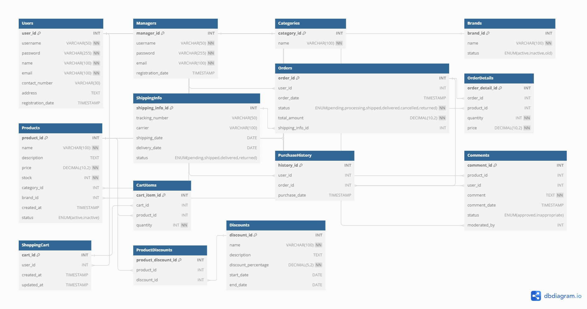

# OnlineShopping Database

This repository contains the MySQL database schema for an online shopping system. The schema is designed to manage users, managers, products, categories, brands, orders, shopping carts, purchase history, comments, shipping information, and discounts.

## Database Schema

The schema includes the following tables:

- `Users`
- `Managers`
- `Categories`
- `Brands`
- `Products`
- `Orders`
- `ShippingInfo`
- `OrderDetails`
- `ShoppingCart`
- `CartItems`
- `PurchaseHistory`
- `Comments`
- `Discounts`
- `ProductDiscounts`

## Table Descriptions

### Users
- `user_id`: Primary key, auto-increment
- `username`: Unique, not null
- `password`: Not null
- `name`: Not null
- `email`: Unique, not null
- `contact_number`: Optional
- `address`: Optional
- `registration_date`: Default to current timestamp

### Managers
- `manager_id`: Primary key, auto-increment
- `username`: Unique, not null
- `password`: Not null
- `email`: Unique, not null
- `registration_date`: Default to current timestamp

### Categories
- `category_id`: Primary key, auto-increment
- `name`: Unique, not null

### Brands
- `brand_id`: Primary key, auto-increment
- `name`: Unique, not null
- `status`: ENUM('active', 'inactive', 'old') DEFAULT 'active'

### Products
- `product_id`: Primary key, auto-increment
- `name`: Not null
- `description`: Optional
- `price`: Not null
- `stock`: Not null
- `category_id`: Foreign key to `Categories`
- `brand_id`: Foreign key to `Brands`
- `created_at`: Default to current timestamp
- `status`: ENUM('active', 'inactive') DEFAULT 'active'

### Orders
- `order_id`: Primary key, auto-increment
- `user_id`: Foreign key to `Users`
- `order_date`: Default to current timestamp
- `status`: ENUM('pending', 'processing', 'shipped', 'delivered', 'cancelled', 'returned'), not null
- `total_amount`: Not null
- `shipping_info_id`: Foreign key to `ShippingInfo`

### ShippingInfo
- `shipping_info_id`: Primary key, auto-increment
- `tracking_number`: Optional
- `carrier`: Optional
- `shipping_date`: Optional
- `delivery_date`: Optional
- `status`: ENUM('pending', 'shipped', 'delivered', 'returned'), default 'pending'

### OrderDetails
- `order_detail_id`: Primary key, auto-increment
- `order_id`: Foreign key to `Orders`
- `product_id`: Foreign key to `Products`
- `quantity`: Not null
- `price`: Not null

### ShoppingCart
- `cart_id`: Primary key, auto-increment
- `user_id`: Foreign key to `Users`
- `created_at`: Default to current timestamp
- `updated_at`: Default to current timestamp

### CartItems
- `cart_item_id`: Primary key, auto-increment
- `cart_id`: Foreign key to `ShoppingCart`
- `product_id`: Foreign key to `Products`
- `quantity`: Not null

### PurchaseHistory
- `history_id`: Primary key, auto-increment
- `user_id`: Foreign key to `Users`
- `order_id`: Foreign key to `Orders`
- `purchase_date`: Default to current timestamp

### Comments
- `comment_id`: Primary key, auto-increment
- `product_id`: Foreign key to `Products`
- `user_id`: Foreign key to `Users`
- `comment`: Not null
- `comment_date`: Default to current timestamp
- `status`: ENUM('approved', 'inappropriate') DEFAULT 'approved'
- `moderated_by`: Foreign key to `Managers`

### Discounts
- `discount_id`: Primary key, auto-increment
- `name`: Not null
- `description`: Optional
- `discount_percentage`: Not null
- `start_date`: Optional
- `end_date`: Optional

### ProductDiscounts
- `product_discount_id`: Primary key, auto-increment
- `product_id`: Foreign key to `Products`
- `discount_id`: Foreign key to `Discounts`

## ER Diagram



## Folder Structure

- **Code**
  - Contains the database SQL code and two Python files:
    - `DataGenerator.py`: Generates fake data for the database.
    - `SampleQueries.py`: Contains sample query functions
  - `environment.yml`: File to set up the project environment with conda.

- **Documents**
  - Contains project documentation in Persian.

- **Normalized ER Diagram**
  - Contains the normalized ER diagram designed for this database.

- **Sample Generated Data**
  - Contains sample data generated using the `DataGenerator.py` script.

## Installation

1. Clone the repository:
   ```bash
   git clone https://github.com/yourusername/OnlineShopping_Database.git
   cd OnlineShopping_Database
   ```

2. Create the database and tables:
   ```bash
   mysql -u yourusername -p < schema.sql
   ```

4. Set up the project environment using conda for the python files:
   ```bash
   conda env create -f environment.yml
   conda activate OnlineShopping
   ```

## Usage

- Use the schema to manage the online shopping system.
- Modify the schema as per your project's requirements.
- Generate sample data using the `DataGenerator.py` script.
- Use `SampleQuery.py` for sample query functions.
- Ensure to handle the relationships and constraints appropriately.

## Contributing

Contributions are welcome! Please fork this repository and submit pull requests.

If you have any question feel free and email me: [Kiarash Mokhtari](mailto:mokhtarikiarash@gmail.com)

## License

This project is licensed under the MIT License. See the LICENSE file for details.


