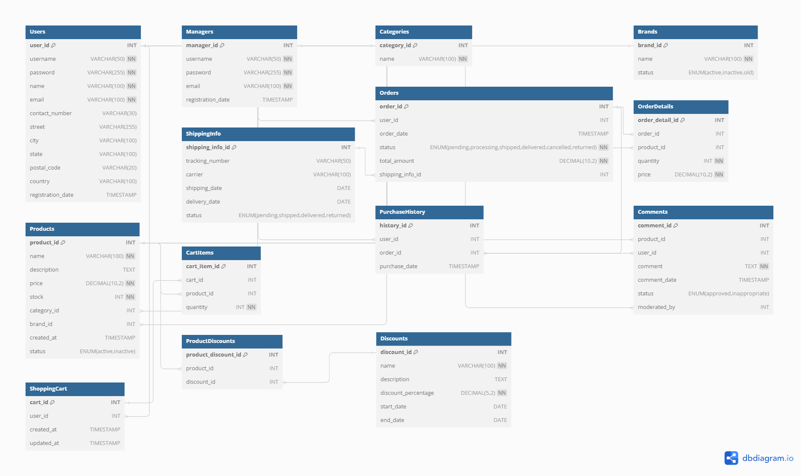

# OnlineShopping Database

This repository contains the MySQL database schema for an online shopping system. The schema is designed to manage users, managers, products, categories, brands, orders, shopping carts, purchase history, comments, shipping information, and discounts.

## ER Diagram



You can also view the ER diagram on [dbdiagram.io](https://dbdiagram.io/d/DB_Project_Phase1_9830032-6682ae039939893daeb973ae).

## Database Schema

The schema includes the following tables:

- `Users`
- `Managers`
- `Categories`
- `Brands`
- `Products`
- `Orders`
- `ShippingInfo`
- `OrderDetails`
- `ShoppingCart`
- `CartItems`
- `PurchaseHistory`
- `Comments`
- `Discounts`
- `ProductDiscounts`

## Table Descriptions

### Users

- `user_id`: Primary key, auto-increment
- `username`: Unique, not null
- `password`: Not null
- `name`: Not null
- `email`: Unique, not null
- `contact_number`: Optional
- `street`: Optional
- `city`: Optional
- `state`: Optional
- `postal_code`: Optional
- `country`: Optional
- `registration_date`: Default to current timestamp

### Managers

- `manager_id`: Primary key, auto-increment
- `username`: Unique, not null
- `password`: Not null
- `email`: Unique, not null
- `registration_date`: Default to current timestamp

### Categories

- `category_id`: Primary key, auto-increment
- `name`: Unique, not null

### Brands

- `brand_id`: Primary key, auto-increment
- `name`: Unique, not null
- `status`: ENUM('active', 'inactive', 'old') DEFAULT 'active'

### Products

- `product_id`: Primary key, auto-increment
- `name`: Not null
- `description`: Optional
- `price`: Not null
- `stock`: Not null
- `category_id`: Foreign key to `Categories`
- `brand_id`: Foreign key to `Brands`
- `created_at`: Default to current timestamp
- `status`: ENUM('active', 'inactive') DEFAULT 'active'

### Orders

- `order_id`: Primary key, auto-increment
- `user_id`: Foreign key to `Users`
- `order_date`: Default to current timestamp
- `status`: ENUM('pending', 'processing', 'shipped', 'delivered', 'cancelled', 'returned'), not null
- `total_amount`: Not null
- `shipping_info_id`: Foreign key to `ShippingInfo`

### ShippingInfo

- `shipping_info_id`: Primary key, auto-increment
- `tracking_number`: Optional
- `carrier`: Optional
- `shipping_date`: Optional
- `delivery_date`: Optional
- `status`: ENUM('pending', 'shipped', 'delivered', 'returned'), default 'pending'

### OrderDetails

- `order_detail_id`: Primary key, auto-increment
- `order_id`: Foreign key to `Orders`
- `product_id`: Foreign key to `Products`
- `quantity`: Not null
- `price`: Not null

### ShoppingCart

- `cart_id`: Primary key, auto-increment
- `user_id`: Foreign key to `Users`
- `created_at`: Default to current timestamp
- `updated_at`: Default to current timestamp

### CartItems

- `cart_item_id`: Primary key, auto-increment
- `cart_id`: Foreign key to `ShoppingCart`
- `product_id`: Foreign key to `Products`
- `quantity`: Not null

### PurchaseHistory

- `history_id`: Primary key, auto-increment
- `user_id`: Foreign key to `Users`
- `order_id`: Foreign key to `Orders`
- `purchase_date`: Default to current timestamp

### Comments

- `comment_id`: Primary key, auto-increment
- `product_id`: Foreign key to `Products`
- `user_id`: Foreign key to `Users`
- `comment`: Not null
- `comment_date`: Default to current timestamp
- `status`: ENUM('approved', 'inappropriate') DEFAULT 'approved'
- `moderated_by`: Foreign key to `Managers`

### Discounts

- `discount_id`: Primary key, auto-increment
- `name`: Not null
- `description`: Optional
- `discount_percentage`: Not null
- `start_date`: Optional
- `end_date`: Optional

### ProductDiscounts

- `product_discount_id`: Primary key, auto-increment
- `product_id`: Foreign key to `Products`
- `discount_id`: Foreign key to `Discounts`

## Folder Structure

- **Code**

  - Contains the database SQL code and two Python files:
    - `DataGenerator.py`: Generates fake data for the database.
    - `SampleQueries.py`: Contains sample query functions and CLI for user and manager.
  - `environment.yml`: File to set up the project environment with conda.

- **Documents**

  - Contains project documentation in Persian.

- **Normalized ER Diagram**

  - Contains the normalized ER diagram designed for this database.

- **Sample Generated Data**
  - Contains sample data generated using the `DataGenerator.py` script.

## Installation

1. Clone the repository:

   ```bash
   git clone https://github.com/Kiarashmo/OnlineShopping_Database.git
   cd OnlineShopping_Database

   ```

2. Create the database and tables:

   ```bash
   mysql -u <your_mysql_username> -p < SQL_Code.sql
   ```

3. Populate the database with sample data:

   ```bash
   mysql -u <your_mysql_username> -p < Data.sql
   ```

4. Set up the project environment using conda for the python files:
   ```bash
   conda env create -f environment.yml
   conda activate OnlineShopping
   ```

### Running the Sample CLI

- **User Sign Up**:

  ```sh
  python SampleQueries.py user sign_up --username johndoe --password securepassword --name "John Doe" --email john.doe@example.com --contact_number 123-456-7890 --street "123 Main St" --city Anytown --state Anystate --postal_code 12345 --country USA
  ```

- **User Login**:

  ```sh
  python SampleQueries.py user login --username johndoe --password securepassword
  ```

  - After logging in as a user, you will be prompted to choose a query:
    ```plaintext
    Choose a query:
    1: Check brand availability
    2: Check total spending in a month
    3: List of user's orders
    0: Exit
    ```

- **Manager Login**:

  ```sh
  python SampleQueries.py manager login --username admin --password adminpassword
  ```

  - After logging in as a manager, you will be prompted to choose a query:
    ```plaintext
    Choose a query:
    1: Users with recent purchases
    2: Total sales by category
    3: Pending orders
    4: Low stock products
    5: High spending users
    6: Add discount
    7: Label comment inappropriate
    8: Top selling products last month
    9: Inactive brands and product count
    10: Total discount by product last month
    11: Custom query
    0: Exit
    ```

- **Add Manager**:

  ```sh
  python SampleQueries.py manager add_manager --username newmanager --password newmanagerpassword --email new.manager@example.com
  ```

- **Custom Query**:

  ```sh
  python SampleQueries.py manager custom_query --query "SELECT * FROM Users"
  ```

## Contributing

Contributions are welcome! Please fork this repository and submit pull requests.

If you have any question feel free and email me: [Kiarash Mokhtari](mailto:mokhtarikiarash@gmail.com)

## License

This project is licensed under the GENERAL PUBLIC License. See the LICENSE file for details.
